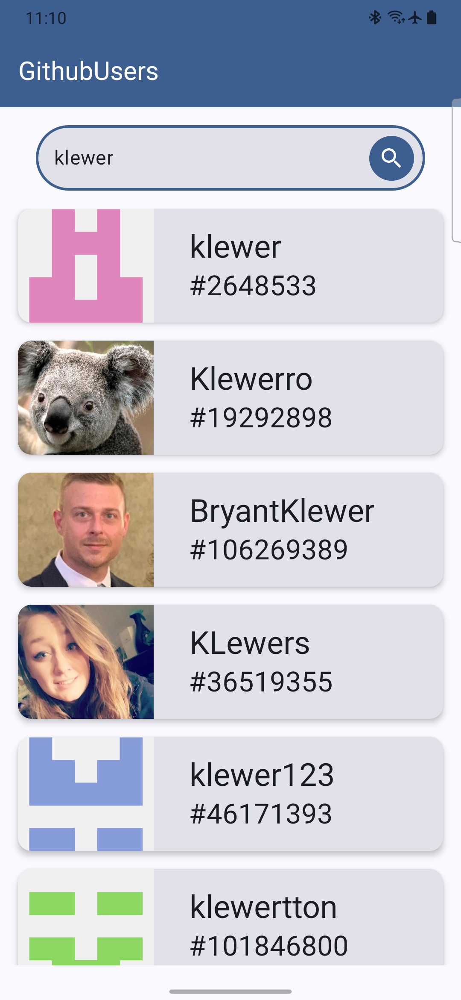
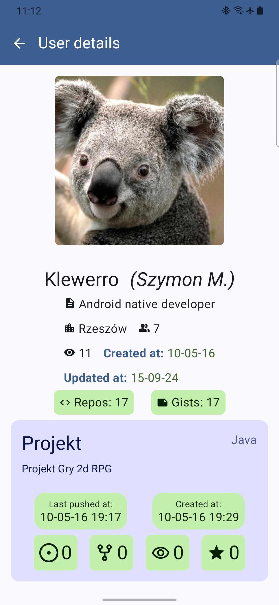
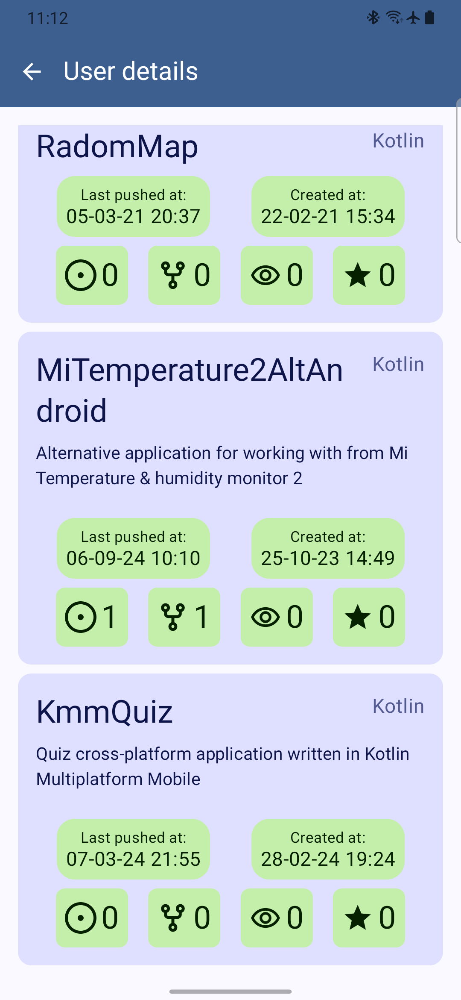
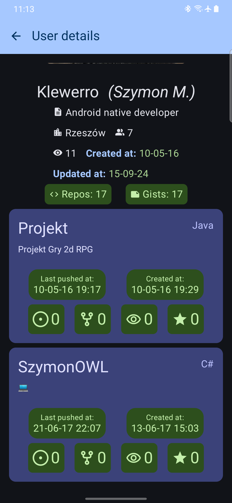

# Github Users

Android application that displays a list of GitHub users and their details across two screens using [official Github API](https://docs.github.com/en/rest?apiVersion=2022-11-28).
In the user list view, data is paginated and cached. New data is downloaded and saved automatically as you scroll through the list. You can refresh data completely by "pull-to-refresh".

The user information view consists of a header with information about the user, and a list of repositories.if the user has already been registered, the data is retrieved directly from the database. You can refresh data by "pull-to-refresh".

### Features:
- Offline support - cached data is displayed first.
- Pagination with cache
- Remembering search phrase
- Navigation transition animation (shared avatar and userName)

### Technical stack:
- Kotlin
- Flow and Coroutines
- Jetpack Compose
- Paging 3
- Coil
- Ktor
- Koin
- Room
- DataStore

|||
|---|---|
|||